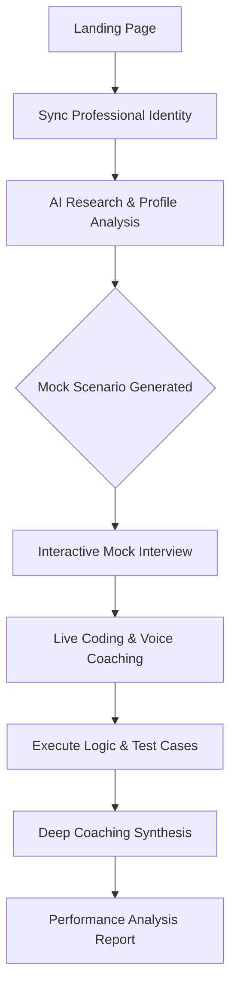

# Nexus AI Interview Prep

Nexus is a sophisticated mock technical interview simulator designed for elite software engineers. By autonomously researching your professional identity—including LinkedIn highlights and GitHub repositories—Nexus constructs personalized, high-stakes coding challenges that help you practice under production-like conditions.

## 🎯 Purpose
This platform is built for **candidates** to refine their technical communication, architectural thinking, and implementation speed. It acts as a high-fidelity "sparring partner" to help you identify logic gaps and communication friction before your real interview.

## 🚀 Key Features

- **Personalized Mock Sessions**: Nexus uses Grounding APIs to research your specific tech stack, ensuring challenges are relevant to your career level.
- **Low-Latency Dialogue**: Practice technical explanation through real-time, human-like voice interaction powered by Gemini 2.5 Flash.
- **Full Engineering Sandbox**: Implement solutions in a professional-grade workspace with an integrated code editor and runtime terminal.
- **Coaching & Logic Audits**: Receive a comprehensive post-session critique covering code efficiency, communication clarity, and alignment with industry standards.
- **Project-Specific Probing**: The AI coach asks deep-dive questions specifically about *your* past projects to simulate real-world seniority checks.

## 🛠 Preparation Workflow



## 💻 Setup

Nexus requires an environment with access to the Google Gemini API.

1. **Clone the repository**:
   ```bash
   git clone https://github.com/your-username/nexus-ai-interview-prep.git
   cd nexus-ai-interview-prep
   ```

2. **Environment Configuration**:
   Ensure your hosting provider (e.g., Vercel, Netlify) has a valid `process.env.API_KEY` configured.

3. **Deploy**:
   The application is optimized for static deployment with ES6 module support.

## 🎨 Design Language
- **Accent**: `#00A3FF` (Nexus Blue)
- **Background**: `#0d1117` (Cyber Noir)
- **Philosophy**: Minimalist, professional, and focus-driven.

## ⚖️ License
MIT License - Copyright (c) 2024 Nexus AI Prep.
